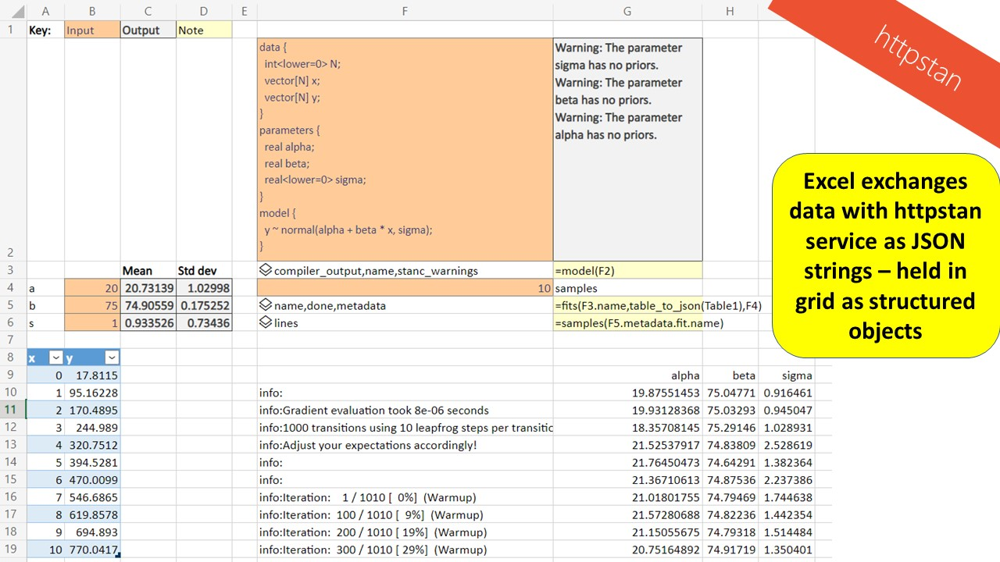

The purpose of this document is explain how to install an httpstan server, and how to interact with it using Excel for the web.

 

# How to install httpstan on Ubuntu in WSL2 on Windows 11

## Set up WSL

According to [Install Linux on Windows with WSL](https://docs.microsoft.com/en-us/windows/wsl/install), you can now install everything you need to run Windows Subsystem for Linux (WSL) by entering this command in an administrator PowerShell or Windows Command Prompt and then restarting your machine.
>wsl --install

You get the Ubuntu distribution by default.
It will prompt you to create a default account and password.

Scott Hanselman has a great YouTube video [WSL2, Visual Studio Code, Windows 10, Ubuntu/Linux + more](https://www.youtube.com/watch?v=Owrk9UxnMdI) worth watching to get familiar with WSL and also the Windows Terminal system for managing shells.

Enter all the commands below into a Ubuntu shell.

## View your Ubuntu directory using Windows explorer

>explorer.exe .

The Ubuntu file system is exposed to Windows, and you can use Windows Explorer to view and edit it.

## Set up C++ compiler

>sudo apt install gcc

>gcc --version

That returns: "gcc (Ubuntu 9.4.0-1ubuntu1~20.04.1) 9.4.0"

(Stan could also use clang but I couldn't get it to install.)

## Set up Python3

Ubuntu comes with python3, but not pip.

Download get-pip.py from the link on this [Stackoverflow page](https://stackoverflow.com/questions/4750806/how-do-i-install-pip-on-windows).

Then install pip by saying:
>sudo python get-pip.py

Then this magic is needed as per [Stackoverflow](https://stackoverflow.com/questions/21530577/fatal-error-python-h-no-such-file-or-directory).
>sudo apt-get install python3-dev

## Set up httpstan
First, off I tried installing prebuilt:
>python3 -m pip install httpstan

That did not work properly. TODO: check if the **magic** above fixed the problem without needing to compile from source.

So instead I followed the instructions on this [Stan Discourse page](https://discourse.mc-stan.org/t/httpstan-in-wsl2-ubuntu/23339/2) to compile from source.

## Testing httpstan

Follow the instructions on the [httpstan](https://httpstan.readthedocs.io/en/latest/).

These were the commands I used.

Start the service in one shell.
>python3 -m httpstan

Start another shell and test the service with these commands:

>curl http://localhost:8080/v1/health

>curl -H "Content-Type: application/json" --data '{"program_code":"data { real mu; } parameters {real y;} model {y ~ normal(mu,1);}"}' http://localhost:8080/v1/models

You have to edit the encoded identifiers below based on the answer from the first command. Beware that this command returns lots of compiler warnings, which appear to be safe to ignore.

>curl -H "Content-Type: application/json" --data '{"function":"stan::services::sample::hmc_nuts_diag_e_adapt", "data":{"mu":7.0}, "num_samples":10}' http://localhost:8080/v1/models/fz2ieyrd/fits

>curl http://localhost:8080/v1/models/fz2ieyrd/fits/6rkc5fex > myfit.jsonlines

Go back to the first shell and stop the service with Control-C.

The documentation for these REST APIs is [HTTP-based REST API](https://httpstan.readthedocs.io/en/latest/rest_api.html).

Another example:
>curl -X POST http://localhost:8080/v1/models/fz2ieyrd/params

That's it.

# How to use httpstan from Excel for the web


Install [Script Lab](https://www.microsoft.com/en-us/garage/profiles/script-lab/) in Excel for the web.

Install these [TypeScript functions](https://github.com/microsoft/advanced-formula-environment/blob/main/examples/excel-json.ts) by loading using Script Lab.

Install [Advanced Formula Environment (AFE)](https://aka.ms/get-afe) in Excel for the web.

Install the following LAMBDAs using AFE.

```
// TODO: get this to work with non-numeric and missing entries
table_to_json = lambda(range,
let(N,rows(range),
    json_0, text_to_json("N")&":"&N,
    r_headers,offset(range,-1,,1),
    maker, lambda(i,j,
      let(header, index(r_headers,,j),
          c_vec, index(range,,j),
          json_1, TEXTJOIN(",",FALSE,c_vec),
          json_2, text_to_json(header)&":"&"["&json_1&"]",
          json_2  )),
    bindings,MAKEARRAY(1,columns(range),maker),
    json_3, "{"&json_0&","&TEXTJOIN(",",FALSE,bindings)&"}",
    json_3
));

text_to_json = lambda(text,
let(splits, TEXTSPLIT(text,,CHAR(10)),
    outcome, textjoin("\n",false,splits),
    quote(outcome)
));

quote = lambda(string, char(34)&string&char(34));

health = lambda(
let(url, "http://localhost:8080/v1/health",
    outcome, SCRIPTLAB.BLANKSNIPPET.GET_JSON(url),
    outcome)
);

model = lambda(code,
let(url, "http://localhost:8080/v1/models",
    post_data, "{"& quote("program_code")&":"&text_to_json(code)&"}",
    outcome, SCRIPTLAB.BLANKSNIPPET.POST_JSON(url,post_data),
    outcome)
);

fits = lambda(model, json_data, N,
let(url, "http://localhost:8080/v1/"&model&"/fits",
    part_1, quote("function")&":"&quote("stan::services::sample::hmc_nuts_diag_e_adapt"),
    part_2, quote("data")&":"&json_data,
    part_3, quote("num_samples")&":"&N,
    post_data, "{"&part_1&","&part_2&","&part_3&"}",
    outcome, SCRIPTLAB.BLANKSNIPPET.POST_JSON(url,post_data),
    outcome)
);

samples = lambda(fits,
let(url, "http://localhost:8080/v1/"&fits,
    outcome, SCRIPTLAB.BLANKSNIPPET.GET_JSON_LINES(url),
    outcome)
);

logger = lambda(fit,
let(lines, fit.lines,
    topic, fit.lines.topic,
    logger, filter(lines,topic="logger").values,
    sample, filter(lines,NOT(ISERROR(lines.values.lp__))).values,
    hstack(logger,sample.alpha,sample.beta,sample.sigma)
));
```